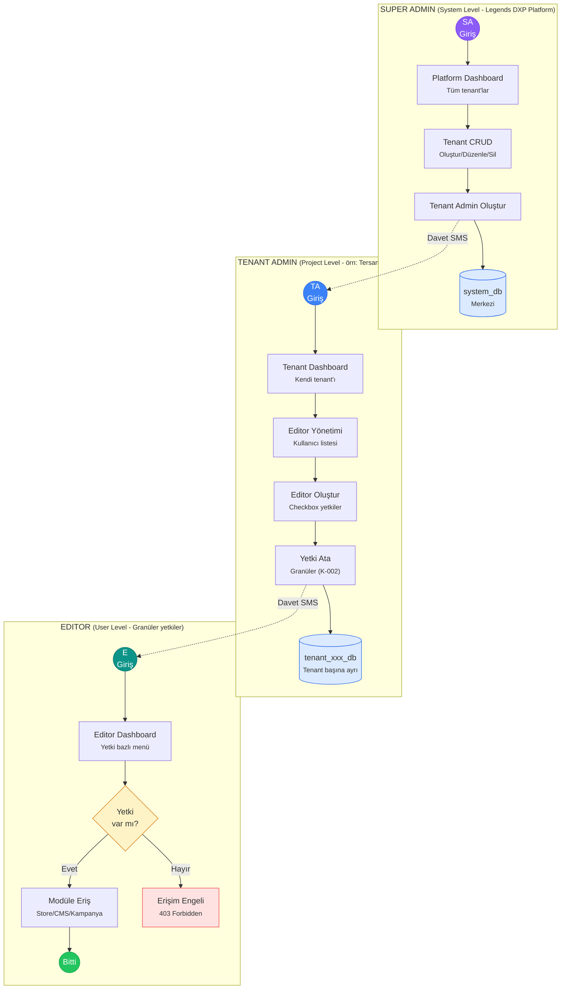

# Admin Hierarchy Flow (K-003)

3 katmanlı yönetici hiyerarşisi - Super Admin → Tenant Admin → Editor

## Veritabanı İzolasyonu

| DB | İçerik |
|----|--------|
| `system_db` | Super Admin, Tenant kayıtları, platform config |
| `tenant_xxx_db` | Her tenant için ayrı (Tenant Admin + Editor + tenant verileri) |

## Kısıtlamalar

- Tenant Admin: Diğer tenant'lara erişim YOK
- Editor: Başka kullanıcı oluşturma yetkisi YOK
