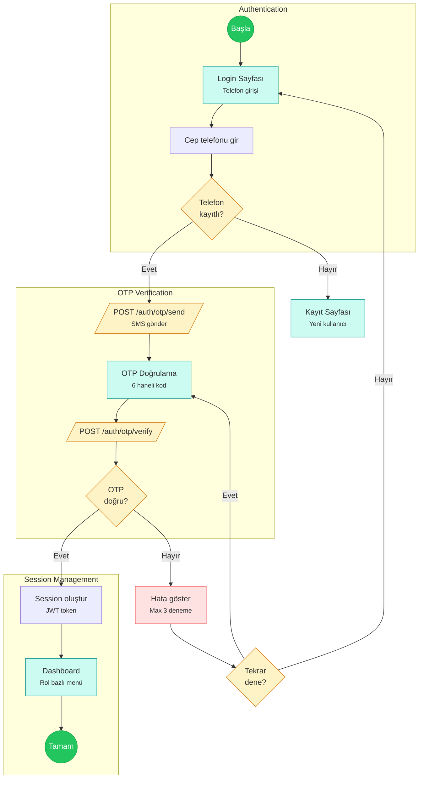

# Authentication Flow (K-001)

Legends DXP kimlik doğrulama akışı - Sadece cep telefonu + OTP ile giriş.

## Notlar

- E-posta ile giriş YOK (K-001)
- Şifre sistemi YOK (K-001)
- Max 3 OTP deneme hakkı, sonra geçici kilitlenme
