# CI/CD Pipeline - GitHub Actions to AWS ECS

Frontend deployment pipeline - Production

```mermaid
flowchart LR
    subgraph GITHUB["GitHub"]
        PUSH["Push to main<br/><small>apps/tersane-nick-web/**</small>"]
        MANUAL["Manual Trigger<br/><small>workflow_dispatch</small>"]
        CHECKOUT["Checkout Code"]
    end

    subgraph AUTH["AWS Authentication"]
        OIDC["OIDC Token<br/><small>id-token: write</small>"]
        ASSUME["Assume Role<br/><small>github-actions</small>"]
    end

    subgraph BUILD["Build & Push"]
        ECR_LOGIN["ECR Login"]
        DOCKER_BUILD["Docker Build<br/><small>frontend.dockerfile</small>"]
        DOCKER_PUSH["Push to ECR<br/><small>nickelodeon/frontend</small>"]
        TAG["Image Tag<br/><small>YYYY-MM-DD-HH-MM-SSZ</small>"]
    end

    subgraph DEPLOY["ECS Deployment"]
        TASK_DEF["Get Task Definition<br/><small>describe-task-definition</small>"]
        RENDER["Render New Task<br/><small>update container image</small>"]
        ECS_DEPLOY["Deploy to ECS<br/><small>nickelodeon cluster</small>"]
    end

    subgraph AWS["AWS ca-central-1"]
        ECR[("ECR<br/>Container Registry")]
        ECS["ECS Cluster<br/><small>nickelodeon</small>"]
        SERVICE["ECS Service<br/><small>frontend</small>"]
    end

    PUSH --> CHECKOUT
    MANUAL --> CHECKOUT
    CHECKOUT --> OIDC
    OIDC --> ASSUME
    ASSUME --> ECR_LOGIN
    ECR_LOGIN --> TAG
    TAG --> DOCKER_BUILD
    DOCKER_BUILD --> DOCKER_PUSH
    DOCKER_PUSH --> ECR
    ECR --> TASK_DEF
    TASK_DEF --> RENDER
    RENDER --> ECS_DEPLOY
    ECS_DEPLOY --> ECS
    ECS --> SERVICE
```

## Pipeline Ozeti

| Adim | Aciklama |
|------|----------|
| **Trigger** | `main` branch'e push veya manual dispatch |
| **Path Filter** | `apps/tersane-nick-web/**` degisiklikleri |
| **Auth** | OIDC ile AWS role assume |
| **Build** | Docker image, timestamp tag |
| **Registry** | AWS ECR `nickelodeon/frontend` |
| **Deploy** | ECS task definition update |
| **Cluster** | `nickelodeon` (ca-central-1) |

## AWS Resources

- **Region:** ca-central-1 (Canada)
- **IAM Role:** `arn:aws:iam::957976799355:role/github-actions`
- **ECR Repository:** `nickelodeon/frontend`
- **ECS Cluster:** `nickelodeon`
- **ECS Service:** `frontend`
- **Task Definition:** `frontend`
