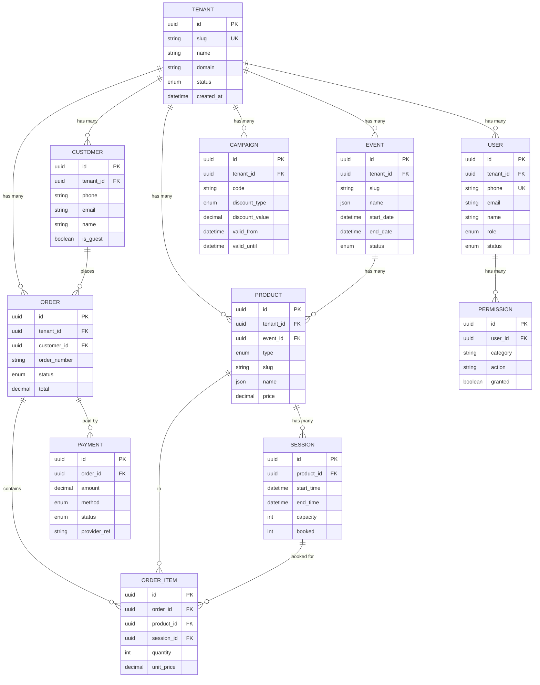

# Domain Model - Entity Relationship

Legends DXP multi-tenant platform entity relationships

## Entity Grupları

| Grup | Entity'ler |
|------|-----------|
| **Auth & Authorization** | User, Permission |
| **Product Catalog** | Event, Product, Session |
| **Commerce** | Order, OrderItem, Payment, Customer, Campaign |
