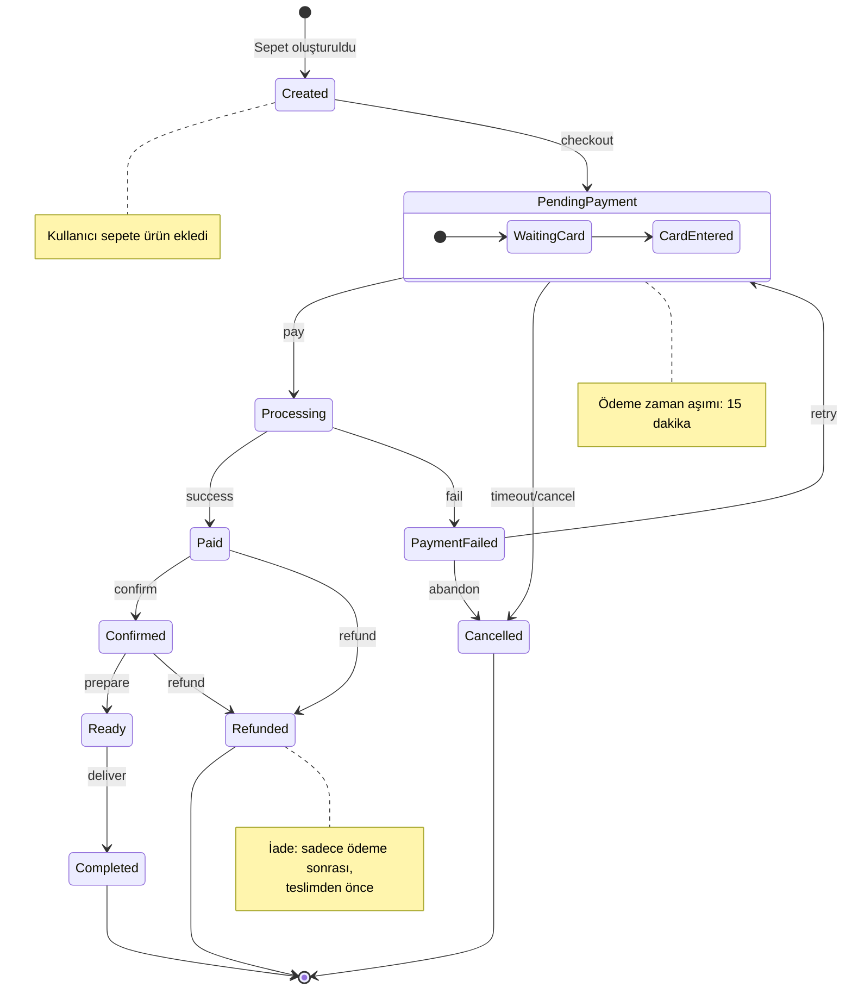

# Order State Machine

Sipariş durumu geçişleri - Order lifecycle

## State Açıklamaları

| State | Açıklama |
|-------|----------|
| **Created** | Sepet oluşturuldu |
| **PendingPayment** | Ödeme bekleniyor |
| **Processing** | Ödeme işleniyor |
| **Paid** | Ödeme tamamlandı |
| **Confirmed** | Sipariş onaylandı |
| **Ready** | Hazırlandı |
| **Completed** | Teslim edildi (Final) |
| **PaymentFailed** | Ödeme başarısız |
| **Cancelled** | İptal edildi (Final) |
| **Refunded** | İade edildi (Final) |

## Transitions

| From | To | Trigger |
|------|----|---------|
| Created | PendingPayment | checkout |
| PendingPayment | Processing | pay |
| Processing | Paid | success |
| Processing | PaymentFailed | fail |
| Paid | Confirmed | confirm |
| Confirmed | Ready | prepare |
| Ready | Completed | deliver |
