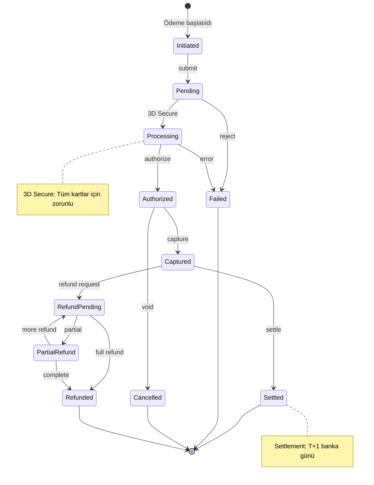

# Payment State Machine

Ödeme durumu geçişleri - Payment lifecycle



## State Açıklamaları

| State | Açıklama |
|-------|----------|
| **Initiated** | Ödeme başlatıldı |
| **Pending** | Onay bekleniyor |
| **Processing** | Banka işlemi (3D Secure) |
| **Authorized** | Yetkilendirildi |
| **Captured** | Tahsil edildi |
| **Settled** | Hesaba aktarıldı (Final) |
| **Failed** | Başarısız (Final) |
| **Cancelled** | İptal edildi (Final) |
| **RefundPending** | İade bekleniyor |
| **Refunded** | İade edildi (Final) |
| **PartialRefund** | Kısmi iade |

## Payment Flow

```
Initiated → Pending → Processing → Authorized → Captured → Settled
                ↓           ↓            ↓
             Failed      Failed      Cancelled
                                         ↓
                              RefundPending → Refunded
                                    ↓
                              PartialRefund
```
